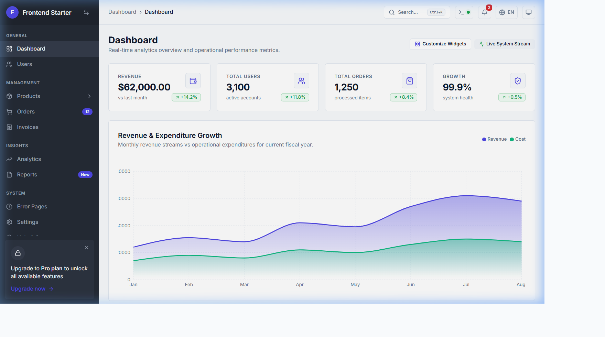
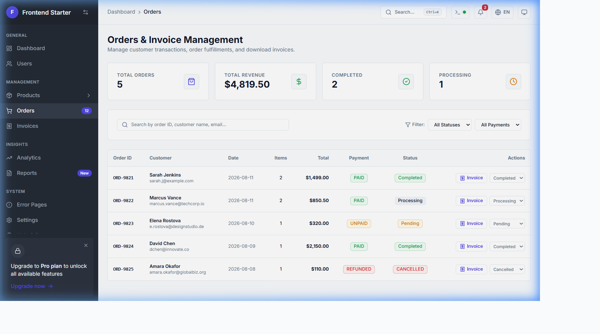
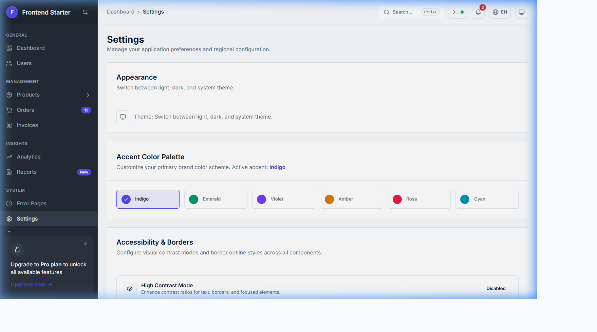

# 🚀 Enterprise Frontend Starter — Vite + React 19 + TypeScript + NestJS Architecture

<div align="center">


*A state-of-the-art, high-performance, accessible Enterprise Admin Portal built with React 19, TypeScript, Vite, Tailwind CSS v4, and Recharts — designed for seamless NestJS REST API integration.*

</div>

---

> [!IMPORTANT]
> **Design Philosophy**: Strictly enforces **Zero Shadows** (`shadow-none`, `border border-border bg-surface`) and **Rounded-MD Radius** across all cards, dialogs, buttons, tooltips, and form inputs.

---

## 📸 Component Screenshots

### 📊 Animated Dashboard & Analytics Overview


### 📦 Orders & Invoice Management


### ⚙️ Appearance, Accent Palette & Accessibility Settings


---

## 🎨 Color Palette & Accent Themes

The portal features a **Dynamic Accent Color Engine** that injects CSS custom properties into `:root` and `.dark` at runtime.

| Accent Color | Primary Hex | Hover Hex | Focus Ring | Status Badge |
|---|---|---|---|---|
| 🟣 **Indigo** *(Default)* | `#4f46e5` | `#4338ca` | `#6366f1` | `bg-indigo-500` |
| 🟢 **Emerald** | `#059669` | `#047857` | `#10b981` | `bg-emerald-500` |
| 🟪 **Violet** | `#7c3aed` | `#6d28d9` | `#8b5cf6` | `bg-violet-500` |
| 🟠 **Amber** | `#d97706` | `#b45309` | `#f59e0b` | `bg-amber-500` |
| 🌹 **Rose** | `#e11d48` | `#be123c` | `#f43f5e` | `bg-rose-500` |
| 🔷 **Cyan** | `#0891b2` | `#0e7490` | `#06b6d4` | `bg-cyan-500` |

---

## 🔥 Key Highlights & Unique Features

### 🔍 Spotlight Command Palette (`Ctrl + K` / `Cmd + K`)
- **Keyboard-First Navigation**: Press `Ctrl + K` anywhere to open the spotlight launcher.
- **Instant Actions**: Switch themes, jump to error pages, change display language, or open the system log drawer.

### 📟 Live NestJS Event & Log Stream Drawer
- **Real-Time Log Simulation**: Emits live NestJS server logs, database queries, and API response metrics.
- **Log Controls**: Filter by level (`INFO`, `WARN`, `ERROR`, `DEBUG`), live text search, `Pause / Resume`, `Clear`, and **Export `.log` file**.

### 📊 Animated SVG Recharts Suite
- **Interactive Visualizations**: Includes Area, Bar, Donut, Radar, and Line charts with 1500ms entrance animations.
- **Custom Tooltips**: Styled with zero shadows, `rounded-md` borders, and formatted metrics.

### 🛠️ Customizable Dashboard Layout
- **Widget Manager**: Click "Customize Widgets" on the Dashboard to toggle visibility of summary metrics and chart sections. Layout preferences are saved in `localStorage`.

### 📦 Orders & Official Invoice Management
- **Full Orders Table**: Located at `/orders` with status badges (`Completed`, `Processing`, `Pending`, `Cancelled`) and payment filters.
- **Printable Invoice Modal**: Itemized invoice preview with subtotal, tax calculation (8%), `Print Invoice`, and `Export CSV`.

### 🌐 Multi-Language i18n
- **Supported Locales**: Live reactive switching between 🇺🇸 English, 🇪🇸 Español, 🇫🇷 Français, and 🇩🇪 Deutsch.

### 👁️ High Contrast & Custom Borders
- **Accessibility Engine**: Toggle High Contrast mode and configure border thickness (`1px Thin`, `2px Medium`, `3px Thick`).

---

## 🛠️ Tech Stack Architecture

```text
src/
├── app/                  # Route tree & App providers
├── components/
│   ├── charts/           # Recharts components (Area, Bar, Donut, Line, Radar)
│   ├── feedback/         # Error Layout, 404, 403, 500, 400, 503, ErrorBoundary
│   ├── layout/           # Fixed Sidebar, Sticky Header, Navbar
│   └── ui/               # Avatar, Badge, Button, Card, Checkbox, Dropdown, Modal, Pagination, Progress, Select, Switch, Tabs, Tooltip
├── config/               # Navigation items & global config
├── constants/            # Routes, Storage Keys, Accent Color dictionary
├── features/
│   ├── dashboard/        # Dashboard page, Recharts, Customizer Modal
│   ├── errors/           # Error showcase page at /errors
│   ├── orders/           # Orders page, Invoice Modal, Mock data
│   ├── settings/         # Appearance, Accent picker, High contrast & border settings
│   ├── system/           # Real-time event log stream service & System log drawer
│   └── users/            # Users page & table
├── hooks/                # Custom React hooks
├── i18n/                 # Translation dictionaries (EN, ES, FR, DE)
├── providers/            # ThemeProvider & React Contexts
├── services/             # Storage service & NestJS API client wrapper
└── styles/               # CSS tokens, theme overrides, custom scrollbars
```

---

## 🚀 Quick Start Guide

### Prerequisites
- Node.js >= 18.0.0
- npm >= 9.0.0

### Installation & Setup

```bash
# Clone the repository
git clone https://github.com/Pandi2352/frontend-starter.git

# Navigate to project directory
cd frontend-starter

# Install dependencies
npm install

# Start Vite dev server
npm run dev
```

---

## 📜 Development Scripts

| Command | Description |
|---|---|
| `npm run dev` | Start local Vite development server at `http://localhost:3000` |
| `npm run typecheck` | Execute TypeScript strict type check |
| `npm run lint` | Run ESLint check across all files |
| `npm run lint:fix` | Automatically fix ESLint formatting & import ordering |
| `npm run build` | Compile optimized production build in `dist/` |
| `npm run preview` | Serve production build locally |

---

## 📄 License

This project is open-source under the [MIT License](LICENSE).
